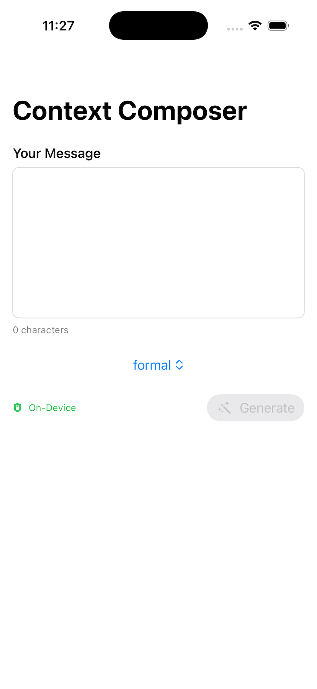

# Context Composer

Transform your messages with AI-powered contextual variations - 100% on-device, 100% private.



📖 **Read the full story**: [Context Composer Showcase - Building Privacy-First AI with Apple's Foundation Models](https://sahilsatralkar.com/ios%20development/swiftui/ai%20technology/context-composer-showcase/)

## Overview

Context Composer is a cutting-edge iOS app that leverages Apple's Foundation Models framework to generate contextually appropriate response variations for different professional scenarios. Built exclusively for iOS 26+, it provides instant, intelligent text transformations without any data leaving your device.

### Key Features

- **🔒 100% On-Device Processing**: Your data never leaves your iPhone - complete privacy guaranteed
- **⚡ Instant Generation**: Powered by Apple Intelligence for lightning-fast response variations
- **🎯 Multiple Tones**: Choose from Formal, Casual, Empathetic, Direct, or Diplomatic tones
- **📊 Smart Analysis**: Automatically preserves key points while adapting style
- **✈️ Works Offline**: No internet connection required - perfect for airplane mode
- **📱 Native iOS Experience**: Built with SwiftUI for seamless integration with iOS 26

## Requirements

### Hardware Requirements
- **iPhone**: iPhone 15 Pro, iPhone 15 Pro Max, or iPhone 16 series
- **iPad**: M1 iPad or later with iPadOS 26
- **Apple Intelligence**: Must be enabled in Settings → Apple Intelligence & Siri

### Software Requirements
- iOS 26.0 or later (currently in beta)
- Apple Intelligence enabled on device
- ~150MB free storage space

## Installation

### For Users

1. **From TestFlight** (Beta Testing):
   - Request access from the developer
   - Install TestFlight from the App Store
   - Follow the invitation link to install Context Composer

2. **From App Store** (Coming Soon):
   - Search for "Context Composer" on the App Store
   - Tap "Get" to download and install
   - Ensure Apple Intelligence is enabled in Settings

### For Developers

1. **Clone the Repository**:
   ```bash
   git clone https://github.com/yourusername/ContextComposer.git
   cd ContextComposer
   ```

2. **Open in Xcode**:
   - Requires Xcode 26 Beta 5 or later
   - Open `ContextComposer.xcodeproj`
   - Select your development team in project settings

3. **Build and Run**:
   - Select iPhone 16 Simulator or connected device
   - Press Cmd+R to build and run
   - Ensure device/simulator supports Apple Intelligence

## Usage Guide

### Getting Started

1. **Launch the App**: Open Context Composer from your home screen
2. **Enter Your Message**: Type or paste the text you want to transform
3. **Select Tone**: Choose from Formal, Casual, Empathetic, Direct, or Diplomatic
4. **Generate Response**: Tap the "Generate" button
5. **Copy & Use**: Review the generated response and copy to clipboard

### Example Use Cases

#### Diplomatic Response
- **Input**: "The project is delayed because of technical issues"
- **Tone**: Diplomatic
- **Output**: "I wanted to update you on the project timeline. We've encountered some technical challenges that require additional attention. We're actively working on solutions and will provide a revised timeline by end of day."

#### Empathetic Message
- **Input**: "We need to work overtime this weekend to meet the deadline"
- **Tone**: Empathetic
- **Output**: "I know this is short notice, and I appreciate everyone's dedication. We need some extra hours this weekend to ensure we deliver on time. Let's discuss how we can make this work for everyone and plan some well-deserved time off afterward."

#### Formal Communication
- **Input**: "Your request cannot be completed as specified"
- **Tone**: Formal
- **Output**: "We have carefully reviewed your requirements. Upon thorough analysis, we have identified certain specifications that present implementation challenges. We would appreciate the opportunity to discuss alternative approaches that could effectively achieve your objectives."

#### Direct Response
- **Input**: "The meeting needs to be rescheduled"
- **Tone**: Direct
- **Output**: "The meeting must be moved to a different time. Please let me know your availability for later this week."

#### Casual Message
- **Input**: "Thanks for helping with the presentation"
- **Tone**: Casual
- **Output**: "Hey, really appreciate you jumping in to help with the presentation! You saved the day."

## Technical Architecture

### Core Technologies
- **Language**: Swift 6.0
- **UI Framework**: SwiftUI with Liquid Glass design system
- **AI Framework**: Foundation Models (iOS 26 exclusive)
- **Architecture Pattern**: MVVM with @Observable
- **Concurrency**: Swift 6 async/await

### Key Components
- **AIService**: Manages Foundation Models integration and response generation
- **ResponseVariation**: @Generable model for structured AI output
- **ContentView**: Main interface with input and response display
- **ResponseCard**: Reusable component for displaying variations

### Performance
- Response generation: < 3 seconds
- Memory usage: < 150MB peak
- Startup time: < 1 second
- Context window: 4,096 tokens

## Privacy & Security

### Your Data is Safe
- **No Network Calls**: AI processing happens entirely on your device
- **No Data Collection**: We don't collect, store, or transmit any user data
- **No Analytics**: Zero tracking or telemetry
- **No Cloud Processing**: Everything runs locally using Apple Intelligence
- **Secure by Design**: Leverages iOS sandboxing and security features

### Verification
Test our privacy commitment:
1. Enable Airplane Mode
2. Turn off WiFi and Cellular
3. App continues to work perfectly - proving 100% on-device processing

## Development

### Project Structure
```
ContextComposer/
├── Models/              # Data models and types
├── Services/            # AI and business logic
├── Views/               # SwiftUI views
├── Resources/           # Assets and configuration
└── Tests/              # Unit and UI tests
```

### Building from Source
```bash
# Build for testing
xcodebuild -project ContextComposer.xcodeproj \
           -scheme ContextComposer \
           -destination 'platform=iOS Simulator,name=iPhone 16' \
           build

# Run tests
xcodebuild test -project ContextComposer.xcodeproj \
                -scheme ContextComposer \
                -destination 'platform=iOS Simulator,name=iPhone 16'
```

### Contributing
We welcome contributions! Please:
1. Fork the repository
2. Create a feature branch
3. Make your changes
4. Submit a pull request

## Troubleshooting

### Common Issues

**"Foundation Models API not available on the Simulator"**
- Solution: The app requires a physical device with Apple Intelligence. The iOS Simulator does not support Foundation Models API. Test on iPhone 15 Pro or later.

**"Apple Intelligence not available"**
- Solution: Go to Settings → Apple Intelligence & Siri → Enable Apple Intelligence

**"Model failed to initialize"**
- Solution: Restart your device and ensure you have at least 1GB free storage

**"Generation takes too long"**
- Solution: Close other apps to free up memory, try shorter input text

**"App crashes on launch"**
- Solution: Ensure you're running iOS 26+ on a compatible device

**"Input text is too long"**
- Solution: The model has a 4,096 token limit. Try shortening your input text.

## Support & Resources

- **Documentation**: [Implementation Guide](implementation-plan.md)
- **API Reference**: [Foundation Models Documentation](FoundationModel.md)
- **Design Document**: [Technical Design](context-composer-design-doc.md)
- **Issues**: [GitHub Issues](https://github.com/yourusername/ContextComposer/issues)
- **Discussions**: [GitHub Discussions](https://github.com/yourusername/ContextComposer/discussions)

## License

Copyright © 2025. All rights reserved.

This project is licensed under the MIT License - see the LICENSE file for details.

## Acknowledgments

- Built with Apple's Foundation Models framework
- Powered by Apple Intelligence
- Developed using SwiftUI and Swift 6
- Special thanks to the iOS developer community

---

**Version**: 1.1.0  
**iOS Target**: 26.0+  
**Last Updated**: December 2024

Made with ❤️ for the privacy-conscious professional